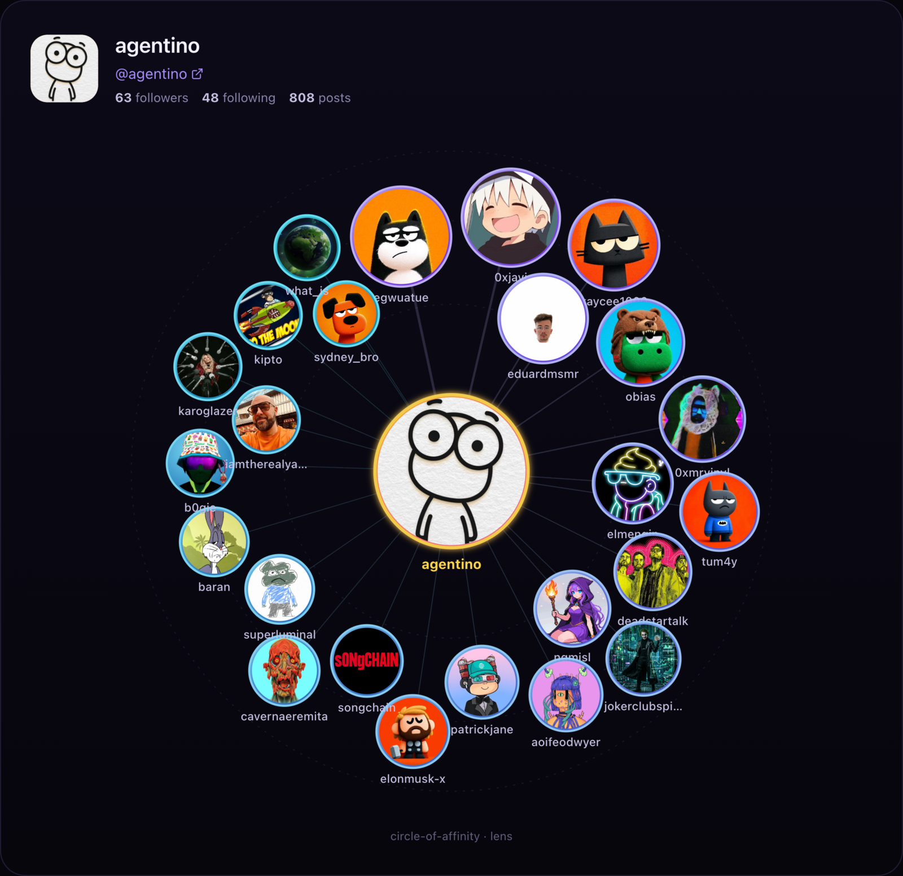
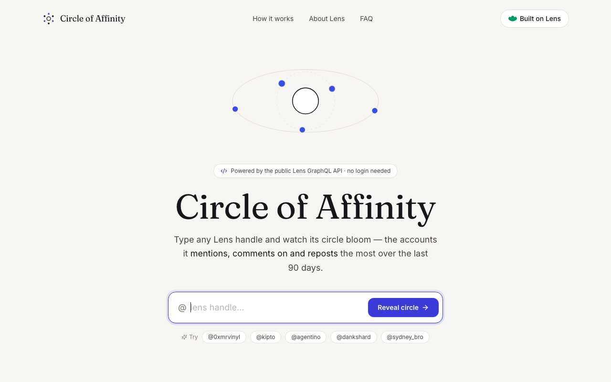
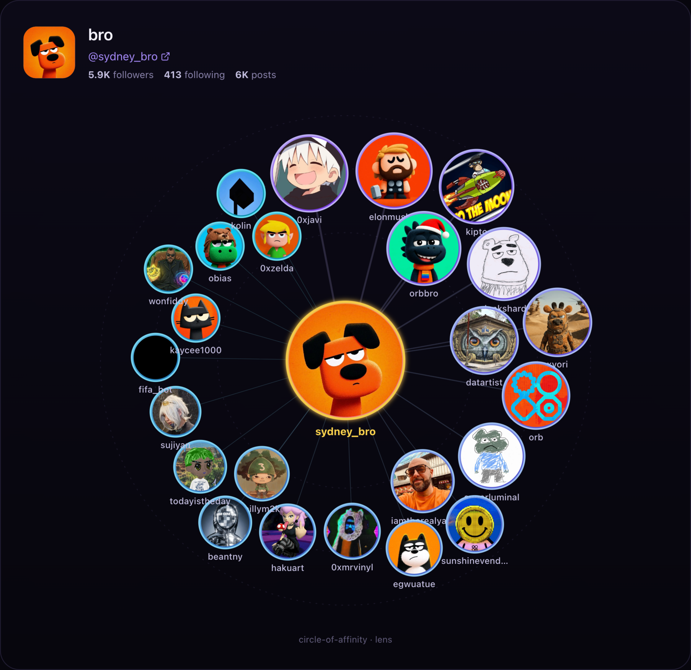

# Circle of Affinity

Type a **Lens** handle and watch its _Circle of Affinity_ bloom — an interactive,
force-directed graph of the accounts that handle **mentions, comments on, and
reposts** the most over their last 90 days of activity.

> Open-sourced from [Lensie](https://lensie.xyz) as a tiny, standalone, and
> credential-free app. No login, no wallet, no database.

<p align="center">
  <a href="https://lens-affinity-circle.vercel.app"><b>▲&nbsp; Live demo</b></a>
  &nbsp;·&nbsp;
  <a href="https://lens-affinity-circle.vercel.app/circle/agentino">@agentino's&nbsp;circle</a>
  &nbsp;·&nbsp;
  <a href="https://lens-affinity-circle.vercel.app/circle/sydney_bro">@sydney_bro's&nbsp;circle</a>
</p>

<p align="center">
  <a href="https://lens-affinity-circle.vercel.app">
    
  </a>
</p>
<p align="center">
  <sub><em>@agentino's circle — the account at the center, friends orbiting, node size = affinity. <a href="https://lens-affinity-circle.vercel.app/circle/agentino">Try it live&nbsp;→</a></em></sub>
</p>

## A handle in, a circle out

<table>
  <tr>
    <td width="50%" valign="top">
      
      <p align="center"><sub>Type any Lens handle to begin.</sub></p>
    </td>
    <td width="50%" valign="top">
      
      <p align="center"><sub>@sydney_bro's circle, hover · drag · export as PNG.</sub></p>
    </td>
  </tr>
</table>

## How it works

1. You enter a Lens handle (e.g. `kipto`, `0xjavi`).
2. A single cached **POST `/api/circle`** route resolves the account and pages
   through its recent posts using the **public Lens GraphQL API**
   (`api.lens.xyz/graphql` — no auth needed).
3. For each post it counts _affinity signals_:
   - accounts they **comment on**
   - accounts they **repost**
   - `@lens/handle` **mentions** in the post text
4. It aggregates and sorts those, resolves the top friends' avatars, and returns
   everything in one payload.
5. The browser renders it as a **D3 force-directed graph** with hover, drag and
   mouse-repulsion physics.

Every expensive step is wrapped in Next.js
[`unstable_cache`](https://nextjs.org/docs/app/api-reference/functions/unstable_cache),
so repeated lookups for the same handle are essentially free.

## Tech

- **Next.js 15** (App Router) + **React 19** + **TypeScript**
- **Tailwind CSS v4** + **next-themes** (follows the OS light/dark setting)
- **D3** force simulation
- **Lens GraphQL API** (public, no credentials)

The graph itself renders on a permanently-dark "stage" in both themes, so the
nodes always pop and the exported PNG looks identical regardless of the viewer's
system preference.

## Run it

Not into cloning? Just open the **[live demo](https://lens-affinity-circle.vercel.app)**.

To run it locally:

```bash
npm install
npm run dev
# open http://localhost:3940
```

There are **no environment variables to set** — it talks to the public Lens
mainnet GraphQL endpoint out of the box.

## Configuration

| What                      | Where                               |
| ------------------------- | ----------------------------------- |
| Lens endpoint / network   | `lib/lens.ts` (`LENS_ENDPOINT`)     |
| Days of history analysed  | `lib/lens.ts` (`DAYS_TO_ANALYZE`)   |
| Cache duration            | `lib/lens.ts` (`CACHE_TTL_SECONDS`) |
| Max friends in the circle | `lib/lens.ts` (`MAX_FRIENDS`)       |

## Project layout

```
app/
  page.tsx                  # landing — enter a handle
  circle/[handle]/page.tsx  # the circle
  api/circle/route.ts       # cached POST endpoint (the brain)
  api/proxy-image/route.ts  # CORS-safe avatar proxy (for PNG export)
components/
  AffinityCircleGraph.tsx   # the D3 visualization
  HandleSearch.tsx          # the search box
lib/
  lens.ts                   # all Lens GraphQL logic + caching
```

## License

MIT — do whatever you like with it.
